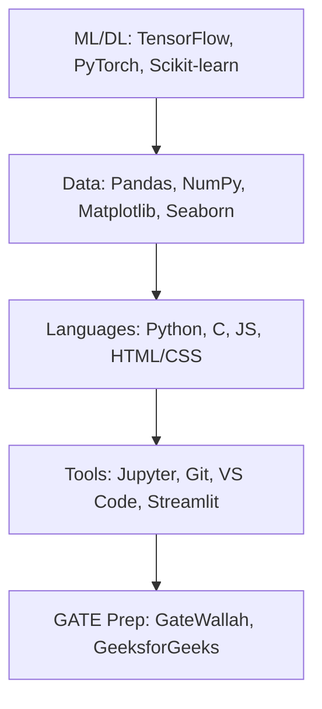

  <!-- Profile Image or Badge -->
  

  
  
  
  
  

### 👨‍💻 About Me
- 🎓 3rd-year B.Tech CSE student at **Government College of Engineering, Nagpur**.
- 🔭 Passionate about **Machine Learning**, **Data Science**, and **AI projects** (e.g., animal disease detection, steganography).
- 📚 Preparing for **GATE 2027** in DA/Data Science & AI—focusing on algorithms, NLP, and deep learning.
- 💼 Seeking internships in AI/ML at Nagpur IT firms.
- 🌱 Currently learning: Transformers, PyTorch, MLOps, and competitive programming (DP, graphs).
- 📫 Reach me: udayahire@example.com | [LinkedIn](https://linkedin.com/in/uday-ahire)

  
  

## 🚀 Featured Projects
| Project | Description | Tech Stack | Links |
|---------|-------------|------------|-------|
| **Animal Disease Detection** | CNN-based ML model to detect diseases in animals from images. | Python, TensorFlow, OpenCV | [Repo](https://github.com/YOUR_USERNAME/project1) &#124; [Demo](https://your-demo-link) |
| **Steganography Tool** | Hide data in images using LSB algorithm with GUI. | Python, Tkinter, Pillow | [Repo](https://github.com/YOUR_USERNAME/project2) |
| **Movie Recommender** | Sentiment-aware recommendation system using collaborative filtering. | Python, Scikit-learn, Pandas | [Repo](https://github.com/YOUR_USERNAME/project3) |
| **Fake News Detector** | NLP model with BERT for real-time news classification. | Python, Hugging Face, Streamlit | [Repo](https://github.com/YOUR_USERNAME/project4) |

📊 GitHub Streak (Click to Expand)

## 🛠️ Tech Stack & Tools

## 📈 Progress

**"Turning data into decisions with code and curiosity."**

  
  

<!-- Star History -->

